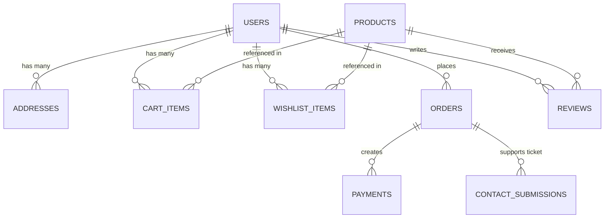

# Star Bags — Firebase Firestore Database Schema Design

This document details the complete Firestore collection and document structure for the **Star Bags** application. Since the application is running completely without backend code, Firestore is designed to handle query filtering and denormalized views directly from the React client.

---

## Database Architecture Overview



---

## 1. `users` (Collection)
Stores customer profiles and basic registration details.

* **Collection Path:** `/users`
* **Document ID:** Firebase Auth `uid` (string)

| Field Name | Data Type | Description | Sample Value |
| :--- | :--- | :--- | :--- |
| `uid` | `string` | The Firebase Auth unique user ID | `"user_12345"` |
| `name` | `string` | Customer's full name | `"John Doe"` |
| `role` | `string` | User Role (`"admin"` \| `"user"`) | `"admin"` |
| `email` | `string` | Customer's email address | `"johndoe@example.com"` |
| `gender` | `string` | Gender option (`"Male"` \| `"Female"` \| `"Other"`) | `"Male"` |
| `mobile` | `string` | 10-digit mobile number | `"9874561230"` |
| `createdAt` | `timestamp` | Time of account creation | `May 26, 2026 at 5:00:00 PM UTC` |
| `updatedAt` | `timestamp` | Time of last profile update | `May 26, 2026 at 5:00:00 PM UTC` |

### Sub-Collections under `/users/{uid}/`

#### A. `addresses` (Sub-Collection)
Stores the list of saved billing/delivery addresses for each user.
* **Path:** `/users/{uid}/addresses`
* **Document ID:** Auto-generated ID (string)

| Field Name | Data Type | Description | Sample Value |
| :--- | :--- | :--- | :--- |
| `id` | `string` | Unique Address ID | `"addr_98765"` |
| `label` | `string` | Name/Label of the address | `"Address 1"` |
| `name` | `string` | Name of the recipient | `"Rahul Sharma"` |
| `email` | `string` | Contact email | `"rahul@example.com"` |
| `contact` | `string` | Mobile number | `"9876543210"` |
| `address` | `string` | Street address, flat/residency | `"Flat No. 302, Sai Residency"` |
| `city` | `string` | City | `"Mumbai"` |
| `state` | `string` | State | `"Maharashtra"` |
| `pin` | `string` | Pincode / ZIP | `"400058"` |
| `createdAt` | `timestamp`| Time of creation | `May 26, 2026 at 5:00:00 PM UTC` |

#### B. `cart` (Sub-Collection)
Stores products currently in the user's shopping cart.
* **Path:** `/users/{uid}/cart`
* **Document ID:** Product ID (`productId`)

| Field Name | Data Type | Description | Sample Value |
| :--- | :--- | :--- | :--- |
| `productId` | `string` | ID of the product (references `/products`) | `"SBP-BAG-00001"` |
| `qty` | `number` | Selected quantity | `2` |
| `selected` | `boolean` | Whether checked for checkout | `true` |
| `addedAt` | `timestamp` | Time when item was added | `May 26, 2026 at 5:05:00 PM UTC` |

#### C. `wishlist` (Sub-Collection)
Stores products in the user's wishlist.
* **Path:** `/users/{uid}/wishlist`
* **Document ID:** Product ID (`productId`)

| Field Name | Data Type | Description | Sample Value |
| :--- | :--- | :--- | :--- |
| `productId` | `string` | ID of the product (references `/products`) | `"SBP-BAG-00001"` |
| `addedAt` | `timestamp` | Time when item was added | `May 26, 2026 at 5:06:00 PM UTC` |

---

## 2. `products` (Collection)
Contains all items for sale (bags, belts, wallets).

* **Collection Path:** `/products`
* **Document ID:** Custom Readable ID (e.g., `SBP-BAG-00001`) or Auto-generated ID

| Field Name | Data Type | Description | Sample Value |
| :--- | :--- | :--- | :--- |
| `id` | `string` | Unique Product ID | `"SBP-BAG-00001"` |
| `name` | `string` | Product name | `"Leather Bag"` |
| `category` | `string` | Main category (`"Bag"` \| `"Belt"` \| `"Wallet"`) | `"Bag"` |
| `subCategory` | `string` | Subcategory or `"-"` | `"Hand Bag"` |
| `material` | `string` | Product material (`"Leather"` \| `"Canvas"`) | `"Leather"` |
| `brand` | `string` | Product brand name or `"-"` | `"American Tourister"` |
| `size` | `string` | Comma-separated string of selected sizes/capacities | `"20L, 30L"` (or `"Small, Medium"` / `"-"`) |
| `capacity` | `string` | Comma-separated string of capacities (Only for Bags, otherwise `"-"`) | `"20L, 30L, 40L"` |
| `price` | `number` | Unit price in INR | `190.00` |
| `discount` | `number` | Discount percentage | `25` (representing 25% OFF) |
| `stocks` | `number` | Stock count available in warehouse | `130` |
| `image` | `string` | Main cover image URL | `"https://images.unsplash.com/...fit=crop"` |
| `images` | `array [string]` | Array of secondary product images (size 5) | `["url1", "url2", null, null, null]` |
| `description` | `string` | Product description (150-200 chars) | `"Midnight Suede Executive Tote..."` |
| `createdAt` | `timestamp` | Time product was posted | `May 26, 2026 at 5:00:00 PM UTC` |
| `updatedAt` | `timestamp` | Time product details were edited | `May 26, 2026 at 5:00:00 PM UTC` |

---

## 3. `orders` (Collection)
Contains order information and invoice data snapshots.

* **Collection Path:** `/orders`
* **Document ID:** Custom Order ID (e.g., `SBO-BAG-20260712-001`) or Auto-generated ID

| Field Name | Data Type | Description | Sample Value |
| :--- | :--- | :--- | :--- |
| `id` | `string` | Unique Order ID | `"SBO-BAG-20260712-001"` |
| `orderDate` | `timestamp` | Time when order was placed | `May 26, 2026 at 5:10:00 PM UTC` |
| `status` | `string` | Order status (`"Order Placed"` \| `"Shipped"` \| `"Out for Delivery"` \| `"Delivered"` \| `"Cancelled"`) | `"Delivered"` |
| `orderType` | `string` | Billing method category (`"Online"` \| `"COD"`) | `"Online"` |
| `paymentMode` | `string` | Type of payment | `"Online payment"` |
| `paymentDetails` | `map` | Payment summary details (see details below) | `{ ... }` |
| `customerDetails`| `map` | Shipping address and client contacts (see below) | `{ ... }` |
| `items` | `array [map]` | Snapshot list of items purchased (see below) | `[ { ... } ]` |
| `tracking` | `array [map]` | Timeline history of shipment stages (see below) | `[ { ... } ]` |

### Detailed Map Structures in `orders`:

#### `paymentDetails` Structure:
```json
{
  "itemsCount": 4,
  "itemsTotal": 1500.00,
  "discount": 500.00,
  "subTotal": 1000.00,
  "gst": 240.00,
  "shippingFee": 0.00,
  "total": 1240.00
}
```

#### `customerDetails` Structure:
```json
{
  "customerId": "user_12345",
  "name": "Vinoth",
  "email": "pandifever@luxury.com",
  "mobile": "+91 98765 43210",
  "shippingAddress": "4517 Washington Ave., Manchester, Kentucky 39495, USA"
}
```

#### `items` List Structure (snapshots representing items bought):
```json
[
  {
    "productId": "SBP-BAG-00001",
    "productName": "Office Bag",
    "category": "Bag",
    "subCategory": "Office bag Casual",
    "brand": "American Tourist",
    "material": "Leather",
    "size": "32 L",
    "quantity": 2,
    "price": 500.00,
    "totalPrice": 1000.00,
    "img": "https://images.unsplash.com/..."
  }
]
```

#### `tracking` List Structure (order stages tracking timeline):
```json
[
  {
    "title": "Order placed",
    "desc": "Your order has been placed",
    "timestamp": "May 26, 2026 at 5:10:00 PM UTC",
    "extraDate": "(On Wed, 4th April)"
  },
  {
    "title": "Order shipped",
    "desc": "Your parcel is in transit",
    "timestamp": "May 27, 2026 at 10:00:00 AM UTC",
    "extraDate": ""
  }
]
```

---

## 4. `coupons` (Collection)
Stores active and scheduled promo/discount coupon codes.

* **Collection Path:** `/coupons`
* **Document ID:** Auto-generated ID or Coupon Code (e.g., `SBC-BAG-001`)

| Field Name | Data Type | Description | Sample Value |
| :--- | :--- | :--- | :--- |
| `id` | `string` | Unique ID of the coupon | `"SBC-BAG-001"` |
| `code` | `string` | Promotional coupon code | `"SBC-BAG-001"` |
| `discount` | `number` | Rate of discount value | `20` |
| `discountType` | `string` | Color style/type: `"green"` (percentage) \| `"blue"` (fixed price) \| `"orange"` (free delivery) | `"green"` |
| `minOrder` | `number` | Minimum cart amount required to apply | `999` |
| `usageLimit` | `number` | Maximum number of allowed redemptions | `5000` |
| `usedCount` | `number` | Current redemption count | `150` |
| `category` | `string` | Category limit (`"Bag"` \| `"Wallet"` \| `"Belt"` \| `"All Products"`) | `"Bag"` |
| `subCategory` | `string` | Subcategory limit (Only if Bag, otherwise `""`) | `"Hand bag"` |
| `desc` | `string` | Conditions of use explanation | `"Enjoy 20% discount on leather hand bags"` |
| `startDate` | `timestamp` | Validity start date | `May 01, 2025 at 12:00:00 AM UTC` |
| `endDate` | `timestamp` | Expiry end date | `May 31, 2025 at 12:00:00 AM UTC` |
| `status` | `string` | Current live state (`"Active"` \| `"Scheduled"` \| `"Expired"`) | `"Expired"` |
| `createdAt` | `timestamp` | Date created | `May 01, 2025 at 12:00:00 AM UTC` |

---

## 5. `reviews` (Collection)
Stores user reviews, comments, and rating reviews for specific products.

* **Collection Path:** `/reviews`
* **Document ID:** Auto-generated ID (string)

| Field Name | Data Type | Description | Sample Value |
| :--- | :--- | :--- | :--- |
| `id` | `string` | Unique Review ID | `"rev_78945"` |
| `productId` | `string` | Target product ID (references `/products`) | `"SBP-BAG-00001"` |
| `productName` | `string` | Name of the product (cached to avoid read joins) | `"American Tourist Travel and Trolley bag"` |
| `image` | `string` | Product image URL | `"https://images.unsplash.com/...fit=crop"` |
| `customerId` | `string` | User ID of reviewer (references `/users`) | `"user_12345"` |
| `customerName` | `string` | Profile name of customer | `"Selva"` |
| `text` | `string` | Body text of review | `"The Product was quite good... satisfied"` |
| `rating` | `number` | Numeric rating score (`1` to `5`) | `5` |
| `likes` | `array` | List of user IDs who liked the review | `["user_12345", "user_12345"]` |
| `dislikes` | `array` | List of user IDs who disliked the review | `["user_12345", "user_12345"]` |
| `likeCount` | `number` | Total number of likes | `5` |
| `dislikeCount` | `number` | Total number of dislikes | `5` |
| `date` | `timestamp` | Time review was submitted | `Dec 24, 2026 at 12:00:00 AM UTC` |
| `isHidden` | `boolean` | Toggled by Admin to hide from public product view | `false` |

---

## 6. `banners` (Collection)
Stores promotional/hero slides shown on the home page and text offers.

* **Collection Path:** `/banners`
* **Document ID:** Auto-generated ID or Type Name (e.g. `offer-banner-texts`)

### Type A: Main Banner Document
```json
{
  "id": "banner_slot_0",
  "type": "main",
  "slotIndex": 0,
  "title": "Signature Duffel Launch",
  "subtitle": "Exclusive Collection",
  "ctaText": "Shop Now",
  "redirectLink": "/shop/duffel",
  "startDate": "2026-01-01",
  "endDate": "2026-12-31",
  "image": "https://storage.googleapis.com/.../banner1.png",
  "status": "ACTIVE",
  "isDefault": true,
  "createdAt": "2026-01-01T00:00:00Z"
}
```

### Type B: Offer Banner Document (`offer-banner-texts`)
A single document that holds the 4 custom marquee lines shown in the ticker.
* **Document Path:** `/banners/offer-banner-texts`
```json
{
  "type": "offer",
  "text1": "Flat 40% OFF on premium handbags and wallets for a limited time.",
  "text2": "New year offer 70 % offer",
  "text3": "bags deal will be closed . grab the deal",
  "text4": "Flat 40% OFF on premium handbags and wallets for a limited time.",
  "updatedAt": "May 26, 2026 at 5:00:00 PM UTC"
}
```

---

## 7. `settings` (Collection)
Admin profile settings and global store business configurations.

* **Collection Path:** `/settings`
* **Document ID:** `store_config` (single document)

```json
{
  "fullName": "Administrator Name",
  "email": "starbags@gmail.com",
  "phone": "+91 8833356757",
  "storeName": "Star Bags India",
  "gstIn": "23 432",
  "storeAddress": "Thindal 432, Erode, Tamil Nadu, India",
  "profilePhoto": "https://i.pravatar.cc/150?u=admin",
  "updatedAt": "May 26, 2026 at 5:00:00 PM UTC"
}
```

---

## 8. `contact_submissions` (Collection)
Stores client support forms / ticket submissions.

* **Collection Path:** `/contact_submissions`
* **Document ID:** Auto-generated ID (string)

| Field Name | Data Type | Description | Sample Value |
| :--- | :--- | :--- | :--- |
| `id` | `string` | Unique submission ID | `"ticket_98242"` |
| `userId` | `string` | ID of the user who submitted (optional) | `"user_12345"` |
| `orderId` | `string` | Reference order ID (references `/orders`) | `"SBO-BAG-20260712-001"` |
| `problemType` | `string` | Problem category (`"Product Damage"` \| `"Product Mismatch"` \| `"Quality Issues"` \| `"Other"`) | `"Product Damage"` |
| `otherProblem` | `string` | Custom problem description (if `"Other"` chosen) | `"Package was opened and torn"` |
| `message` | `string` | Details of request message | `"Hello support, my bag has a cut on the side..."` |
| `status` | `string` | Status of support request (`"Open"` \| `"In Progress"` \| `"Resolved"`) | `"Open"` |
| `createdAt` | `timestamp` | Date and time submitted | `May 26, 2026 at 5:15:00 PM UTC` |

---

## 9. `payments` (Collection)
Stores transactions and logs for auditing in the payment dashboard.

* **Collection Path:** `/payments`
* **Document ID:** Transaction ID (string)

| Field Name | Data Type | Description | Sample Value |
| :--- | :--- | :--- | :--- |
| `id` | `string` | Transaction ID / Document ID | `"SBO-BAG-20260712-001"` |
| `orderId` | `string` | Associated Order ID (references `/orders`) | `"SBO-BAG-20260712-001"` |
| `amount` | `number` | Gross payment amount | `19623.00` |
| `currency` | `string` | ISO currency code | `"INR"` |
| `mode` | `string` | Display description | `"Online Payment"` |
| `method` | `string` | Method code (`"visa"` \| `"mastercard"` \| `"paypal"` \| `"cash"` \| `"card"`) | `"card"` |
| `date` | `timestamp` | Payment execution timestamp | `May 26, 2026 at 5:10:00 PM UTC` |
| `status` | `string` | Transaction outcome status (`"Success"` \| `"Failed"`) | `"Success"` |
